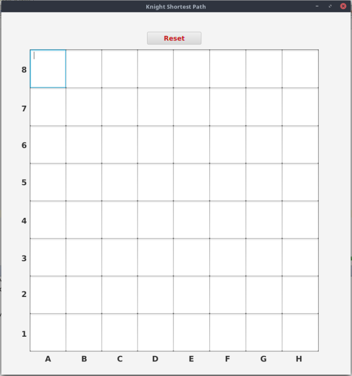

# Chess Shortest Path

Using [Breadth-first search](https://en.wikipedia.org/wiki/Breadth-first_search) algorithm to calculate the shortest path between a given starting position and end position on a chess board.

Right now this is just for a Knight but thanks to its open architecture can easily extend to other pieces using the ChessPiece interface as well as to multiple dimensions and algorithms.


## prerequisites
* Java 1.8

## Build and Deploy
`
$ gradle build installDist
`

## Run with CLI
```
$ cd build/install/chess-shortest-path/bin
$ chess-shortest-path -start E1 -end A7
```
Note:
Positions are in algebraic chess notation

## Run with UI
```
$ cd build/install/chess-shortest-path/bin
$ ./chess-shortest-path
or
$ ./chess-shortest-path -maxMoves 3
```


## Build and Run with Gradle
#### CLI
`
$ gradle build run -Dexec.args="-start E1 -end A7"
`
##### Result
```
:compileJava
:compileGroovy UP-TO-DATE
:processResources UP-TO-DATE
:classes
:run
C2 A3 B5 A7
```
#### UI
`
$ gradle build run
`

